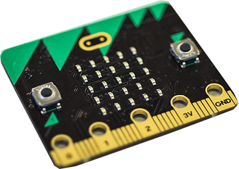

## 01 Design & Making with Microbit - Python
*This lesson introduces the microbit as a piece of hardware that has a specific size and weight, and generally must be supported and incorporated as an essential component of a tangible artifact. Focus on incorporating the physical microbit into a basic making activity.*

## Lesson objectives
Students will…
- Exercise creativity and resourcefulness by coming up with ideas for using simple household materials to accommodate the microbit’s size and weight in many different ways.
- Test and iterate using different materials and sizes in order to create an optimal design to house the microbit and battery pack
- Learn how to download programs and move them to the microbit to run on the microbit.
- Use the design thinking process to develop an understanding for a problem or user need.
- Apply their understanding in a creative way by making a “micro:robot” creature.

## Lesson plan
1. **Introduction:** The microbit is for making
2. **Unplugged:** Design Thinking
3. **Activity:** MakeCode download
4. **Project:** micro:robot (including mods and rubric)
## Standards — CSTA K-12 Computer Science Standards
-2-A-2-1 Solicit and integrate peer feedback as appropriate to develop or refine a program.
-2-A-6-10 Use an iterative design process (e.g., define the problem, generate ideas, build, test, and improve solutions) to solve problems, both independently and collaboratively.

#01.0 Topic Introduction
The microbit is a great way to teach the basics of programming and computer science. The MicroPython coding environment is a powerful and intuitive way to make the microbit react to all sorts of input, and it can introduce fundamental concepts such as loops, conditional statements, and variables using Python (an indemand text based programming language.)

Students often focus primarily on the 5x5 LED screen for providing output. Although this is the most directly accessible way to see a reaction to some kind of input, there are many more creative possibilities when you encourage your students to see the microbit as a “brain” that can control physical, tangible creations.

These creations don’t have to be complex or highly technical. It’s great to have students building with common household supplies. Because the microbit is so lightweight, and supports so many sensors, it can be incorporated easily into a physical design as long as students plan ahead for its size and weight. One of the first questions you might ask students is “Where does the microbit fit in your creation?”

In this first lesson’s project, we focus on making something creative that features the microbit as its “face”. We purposely start this course with a lesson on Making and the physical nature of the microbit, because it is important to set the tone for the whole course that this is a class about making, building, crafting and construction. It helps if you have arts and crafts supplies in your classroom that students can use to build.

Some common making supplies to gather:
-pizza boxes
-scrap cardboard
-colored construction paper
-colored duct tape
-scissors
-pipe cleaners
-stickers
-popsicle sticks
-string
-markers

