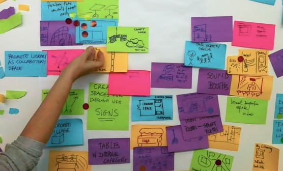

## 01.1 Unplugged: Design Thinking

**Objective:** To introduce a process of design that starts with talking to one another. Whatever you build with code should serve a purpose or fill a need. Sometimes what you build will make the world more beautiful, or help somebody else. Our design process, based on a process called design thinking, can give students a specific framework for thinking purposefully about design. Youtube Design Thinking videos:
Sprouts, “The Design Thinking Process” https://www.youtube.com/watch?v=_r0VX-aU_T8 

**Overview:** In this activity, students will interview each other about their ideal robot. They should take notes. The first step in coding by design involves understanding someone else’s need. Then, you can create prototypes that get you closer and closer to the best solution.

**Materials:** Pairs of students, something to take notes on.

**Getting started:** Pair students up with each other. One is Student A, the other is Student B. The goal of this activity is to gather information from their partner that will help them to design a microbit  robot with help from their partner.

**5 minutes:** Student A interviews Student B. The goal is to find out what Student B considers to be their ideal robot. Student A should mostly listen, and ask questions to keep Student B talking for the entire time. Student A makes some notes in Student B’s notebook. Here are some questions to start with:
- What would you like to have in a robot? What is it?
- What would you like about robot? What do you dislike?
- Is there anything you wish your robot could do? Why?
- Tell me about your ideal robot.

**5 minutes:** Student B interviews Student A, as above.
The goal is to find out more about your partner by asking questions. Try to ask “Why?” as much as possible. Your partner will tell you about his or her ideal robot, but you are really finding out more about your partner’s likes and dislikes. When we design, we create real things for real people. So we need to start with understanding them first.

**5 minutes:** Student A and Student B review their notes, and circle anything that seems as if it will be important to understanding how to create the ideal robot for themselves. Circle ideas, advice, anything that could be helpful when they start building. Then, they should use what they have discovered with their partner to fill in the blanks:

“My partner needs a __________________ because __________________.”

This definition statement should draw some conclusions about their partner’s need based on the conversation they have had with that person.
**5 minutes:** Student A and Student B sketch at least 2-4 ideas of robots from the questions their partner asked. Stick figures and diagrams are okay. At this point, quantity is more important than quality. Students shouldn’t limit themselves to real robots; fictional or far out robots and mashups are totally fine!

Make sure students keep their notes and sketches! They will use them in the project for this lesson.

**Examples:**
Sample notes for discussion with partner.

