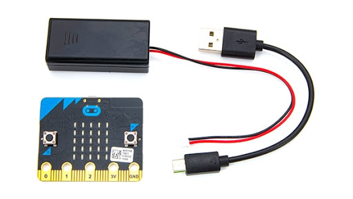
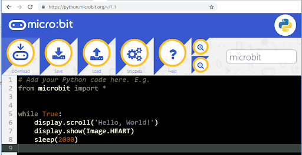
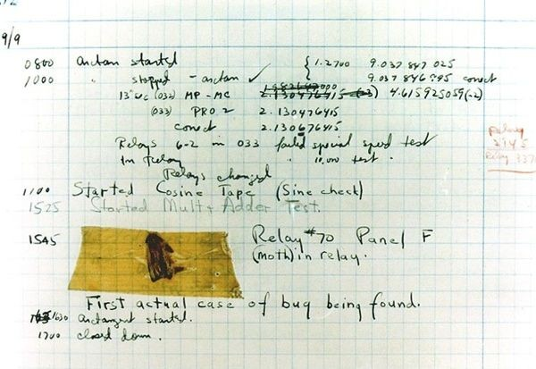
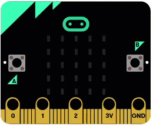
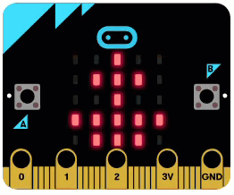

# 01.2 Activity: Installing a program
**Microbit activity:** Installing a MicroPython Program on the microbit

**Objective:** Learn how to download programs from the MicroPython programming tool.

**Overview:** Students will create a simple program in MicroPython and download it to their microbit using a USB cable.

For this activity, students will each need a microbit, a micro-USB cable, a computer, and a battery pack. A computer with Internet access. 



## MicroPython Editor Home screen
Open a browser window to [https://python.microbit.org/v/1.1](https://python.microbit.org/v/1.1)



## Tour of Micro:bit MicroPython Programming Environment
The following instructions come from: Mike Rowbits, “The First Steps with Python”, The Python Software Foundation. [https://python-editor-1-1-3.microbit.org/help.html](https://python-editor-1-1-3.microbit.org/help.html) This work by The Python Software Foundation is licensed under a Creative Commons Attribution-NonCommercial-ShareAlike 4.0 International License.
### Python Editor
The Python editor is perfect for those who want to push their coding skills further. A selection of snippets and a range of pre-made images and music give you a helping hand with your code. The editor is powered by the global Python Community.
### Menu
The main menu of the editor contains various buttons that allow you to interact with the editor and the micro:bit device. If you have additional features enabled in the editor, for example WebUSB you may see extra buttons available in this menu.

As well as using a mouse, you can use the **TAB** key to navigate through the options and **Enter** to activate them. If you're in the text window, The **ESC** key will re-focus on the menu.


Click on the "Download" button to save a special "hex" file on computer. Plug in BBC micro:bit (it'll show up as USB storage) and drag the newly saved file onto the device. Code will run (or you'll see an error message scroll past on the device's display). See below for how to extract code from a hex file back into the editor.


Click on the "Save" button to save the code onto your computer. Because you're downloading Python code computer might check you want to save the file. It's trying to protect you from downloading random software from the internet. But since this is own code you're safe to proceed. See below for how to load code back into the editor.


It's very easy to load files from computer into the editor: click the load button then drag the file from computer onto the grey "drop" area. Alternatively, you could use the file picker (just click on the link at the bottom to toggle between the two options). The editor knows how to read Python files (whose name ends with ".py") and extract Python code from hex files (whose name ends with ".hex").


Clicking on the "Help" button gets you here. But you knew that already, right..? :-) Notice that editor is still available but in a separate tab in browser.


Everyone likes to show off their awesome Python skills. These buttons are especially useful to zoom-in and zoom-out when you're trying to show code to a large group of people via a projector.

The name and description for your script is shown on the top right hand side. Click them to edit them. This is where the program can be named. This should be one of the first things that is done when creating a program.
### Text window
The other part of the editor is the text window, where we edit our scripts.

The editor tries to help out by **colouring** the text to show what all the different parts of program are. For example, **Python keywords** (words built into the Python language) are grey. The brighter coloured words are bits of the program you have created. Brown words are constant values that never change and purple words represent strings of characters to display. All the lines are numbered with the current line highlighted. (
### Downloading a MicroPython program to the microbit
To download the file to your microbit, you must connect it to your computer’s USB port using a micro-USB cable. The microbit will draw power from your computer through the USB connection, or you can connect an optional battery pack so it can function even after it is unplugged from the computer. Once plugged in, the microbit shows up on your computer like a USB flash drive.

Click the Download button on the left side of the menu. This will download the file to your computer, to the location where your browser is set to save downloads. In Chrome it puts in the Downloads folder. It names it using the project name with the .hex extension.
To move the program to your microbit, drag the downloaded “filename.hex” file to the MICROBIT drive, as if you were copying a file to a flash drive. The program will copy over, and it will begin running on the microbit immediately.

The microbit will hold one program at a time. It is not necessary to delete files off the microbit before you copy another onto the microbit; a new file will just replace the old one.
For the next project, your students should attach the battery pack (it takes 2 AAA batteries) to the microbit using the white connector. That way they can build it into their design without having to connect it to the computer.

### Bug Fixes
Things will go wrong!
You have to imagine Python is the most strict language teacher in the universe... yes, even more strict than that really strict one you have at school. Put simply, **you have to type Python without any mistakes for it to work.**

All programmers make mistakes and create **bugs**. It's a fact of life. When you have a bug MicroPython tries to help you out: it will scroll a message on the microbit display. It usually gives **a line number** and says **“SYNTAX ERROR”**.  When this happens you need to go back to the MicroPython editor and fix the error and then download it again to the microbit.
Common bugs include Syntax Errors (which means you've typed it in wrong) and Name Errors (that mean you've typed in correct Python, but it can't work out what you're coding about).

## 01.2a Name Activity
The first MicroPython and microbit activity will be to have the microbit display your name in all CAPS on its LED display.

### Naming the Program
When starting a new program the first thing to do is to name the program. This is done in the box at the right side of the menu bar. Use a descriptive name of what the program is going to do. Since it is the title of the program it would be a good idea to use title capitalization by starting all the important words with a capital. 

### Comments
The first part of each MicroPython program in this book is to add 4 comments at the top of the program. Comment lines are started with a number symbol or hashtag “#”. Everything that follows the “#” is a comment and does not affect the program but is there to explain about the program or what is happening in the program. A good programmer will use lots of comments.

The four comment lines in the program are as follows: 
1. Name of the program using title capitalization. 
Example: # Name Activity
2. Writing your name as the programmer. For students this will be your first name and last initial. 
Example: # by Carl L
3. The date that the program was created. This can be month and year or day, month, and year.  I would suggest not using mm/dd/yyyy because most places in the world use different date systems.
Examples: # April 2019 or # 5 April 2019 or # April 5, 2019 or # 2019 April 5.
4. A description of what the program does. This may also include a project number along with the description. The description may take more than 1 line if needed. 
Example: # This project displays my first name in all CAPS. 

### Module Imports
The first line of actual code is the import line. This tells Python get all of the bits of Python needed to program the microbit. The “*” at the end says to include all of the commands. All commands or lines of code in Python are done in lowercase. 

Example: from microbit import *

At times other other modules (sometimes called packages) like the math may be included in the program with the import code. Example: import math

### display Command
The line of code that tells the microbit to display writing on the LED screen, is the display.scroll(). In this program it will display your name in all CAPS. The parentheses enclose the input or the argument for the display.scroll() code. The name is inside the quotes, “LYMAN”. Anything inside quotes is treated as characters or words. In programming this is known as a string or a string of characters. Throughout this book anytime writing is displayed on the microbit it will be done in all CAPS because the writing is much easier to read on the 5 by 5 LED display. Besides the display.scroll() command there is also a display.show() command that will show a single character, number, symbol, or design without it scrolling.
Example: ```python display.scroll('LYMAN!')```

### MicroPython code:
```python
# Name Activity
# by First L (Firstname LastInital)
# Date: Month 2019
# Description: This activity comes from Module 1 of Coding & Innovation using Microbits - Python
# It displays a name in all CAPS.

from microbit import *
display.scroll('LYMAN!')
```

### Saving Code
It is a good idea to save the program with its code on a regular basis. This is done by clicking on the Save button in the menu. In a Chrome browser the default is to download the file in the Downloads folder. It saves the file as whatever the program is named with the added “.py” extension. The “.py” is the extension for Python source code files. 
Example: “Name Activity.py”

Your browser may give you a warning:

Since you know what it is downloading you can click the “Keep” button so it will download.

The saved Python code file, with the .py extension, can be used later, It can be reopened and edited in a Python editor and revised.


### Download and Install the .hex File
The Download button creates a compiled “.hex” file which will run on the microbit. By default in a Chrome browser it will put the file in the Downloads folder. It will be named the name of the program with the “.hex” file extension. 
Example: “Name Activity.hex”

When the hex file is downloaded it needs to be copied to the microbit. Using the computer’s file manager program, find the file and copy it to the microbit which shows up as a USB drive. Example: D:Microbit. It can be copied by dragging it and dropping it on the USB drive or with a copy and paste.

When the hex file is copied to the microbit a yellow light on the back of the microbit will flash while the program is being copied. When it is finished it should start displaying your first name.

### Sample Display:


### Bugs & Debugging
If there are bugs in the program it will usually give an error message on the microbit. It will say something like: “Line 8 Syntax Error…”. When this happens you will need to go back to Python and find and fix the error. This is call “debugging”. Once it is fixed download the hex file and try it again.

### Extensions
- Have it display your school’s name
- Have it display your school’s mascot
- Add another message to the program
- Have it scroll the date

### Python Microbit Code Creation
For the rest of the programs in this course it will follow the same basic procedure or algorithm as we have done in this first project.
1. Name the project
2. Add comments at the beginning of the program
3. import needed modules
4. Type the code
5. Save the program and code
6. Download and copy the code to the microbit
7. Debug if needed (Repeat steps 4, 5, & 6 until program runs)

## First Instance of Actual Computer Bug Being Found


At 3:45 p.m., Grace Murray Hopper records 'the first computer bug' in the Harvard Mark II computer's log book. The problem was traced to a moth stuck between relay contacts in the computer, which Hopper duly taped into the Mark II's log book with the explanation: “First actual case of bug being found.” The bug was actually found by others but Hopper made the logbook entry.
https://www.computerhistory.org/tdih/september/9/


## 01.2b Icon Display Activity
This program will use some predefined designs called icons and display them on the screen with the display.show() code. The display.show() will use the Image.XXX object and the name icon in all CAPS as input for the code. The sleep() code will be used to pause the running of the program. Another icon will be shown with another sleep() command,  and finally in the end the screen will be cleared with the display.clear() code.

### Getting Started
To get started name the program “Icon Display”, add comments at the beginning of the program, and add the import command as was done in the “Name Activity” project.

### display Show & Icon Designs
The display object has several different methods associated with it. In the “Name Activity” we used the display.scroll() code to scroll a name across the LEDs. In this activity we will use the display.show() code to show a predefined icon on the screen. It will not scroll with the show method. It can be used for 1 character, number, symbol, or design. It can be implemented as display.show(“E”) to show the letter “E” on the screen. Here we will use some predefined icons using the (Image.ICON_NAME) argument. The name of the icon is written in all CAPS since it represents a name that is constant and doesn’t change. 

### Example: display.show(Image.DUCK)
Here are a list of predefined (Image.XXX) icons:

| Icons | Names | Here |
| --- | --- | --- |
| Image.HEART | Image.HEART_SMALL | Image.HAPPY |
| Image.SMILE|Image.SAD | Image.CONFUSED |
Image.ANGRY | Image.ASLEEP | Image.SURPRISED
Image.SILLY | Image.FABULOUS |Image.MEH
Image.YES
Image.NO
Image.CLOCK12 | Image.CLOCK11, Image.CLOCK10, Image.CLOCK9, Image.CLOCK8, Image.CLOCK7, 
Image.CLOCK6, 
Image.CLOCK5,
Image.CLOCK4, Image.CLOCK3, Image.CLOCK2, Image.CLOCK1
Image.ARROW_N, Image.ARROW_NE, Image.ARROW_E, Image.ARROW_SE, Image.ARROW_S, Image.ARROW_SW, Image.ARROW_W, Image.ARROW_NW
Image.TRIANGLE
Image.TRIANGLE_LEFT
Image.CHESSBOARD
Image.DIAMOND
Image.DIAMOND_SMALL
Image.SQUARE
Image.SQUARE_SMALL
Image.RABBIT
Image.COW
Image.MUSIC_CROTCHET
Image.MUSIC_QUAVER
Image.MUSIC_QUAVERS
Image.PITCHFORK
Image.XMAS
Image.PACMAN
Image.TARGET
Image.TSHIRT
Image.ROLLERSKATE
Image.DUCK
Image.HOUSE
Image.TORTOISE
Image.BUTTERFLY
Image.STICKFIGURE
Image.GHOST
Image.SWORD
Image.GIRAFFE
Image.SKULL
Image.UMBRELLA
Image.SNAKE

### sleep(milliseconds) Code
The sleep() code pauses the program for a number of milliseconds. To pause the program for 2 seconds the number 2000 would be used as an argument in the parentheses.
Example: sleep(2000) 

### display.clear()
The clear() method with the display object makes the LED display blank. It has no arguments so there is nothing in the parentheses.

### MicroPython Code:
```python
# 1.2b Icon Display
# by C Lyman
# March 2019
# Activity from Module 1 of Coding & Innovation using Microbits - Python
# Displays Icons from the library

from microbit import *

display.show(Image.SAD)
sleep(2000)
display.show(Image.HAPPY)
sleep(2000)
display.clear
```
### Save, Download, & Debug Program
Once the program has been coded, test it by saving, downloading the program, and copying it to the microbit. Debug it if needed.

### Sample Display:


### Extensions
Add other icons to your program
Try different pauses between icons
Put a title at the beginning of the program, “ICONS”
## 01.2c Icon Animation Activity
This program will animate some predefined designs in a forever loop using the display.show() code and paused using the sleep() code as used in the Icon Display activity. The forever loop is implemented using the while True: code. Lines of code in the loop are all indented one tab.

### Getting Started
To get started name the program “Icon Animation”, add comments at the beginning of the program, and add the import command as was done in the “Name Activity” project.

### while True:
A loop that goes forever can be setup using the while True: code. The while code is used to start a loop. It is followed by a condition that can be evaluated as true or false. In this case we will use the value True which make the loop so it will never be false. The True is followed by a colon “:” which marks the beginning of the lines of code in the loop and all lines of code are indented a tab.

### Example:
```python
while True:
    display.show(Image.HEART_SMALL)
    sleep(100)
    display.show(Image.HEART)
    sleep(100)
 
display.show(), Icon Designs, & sleep()
```
The display show, the icon design and sleep command can be used as introduced in the Icon Display activity.

### MicroPython Code:
```python
# 1.2c Icon Animation
# by C Lyman
# March 2019
# Activity from Module 1 of Coding & Innovation using Microbits - Python
# Displays Icons from the library with animation

from microbit import *

# forever loop
while True:
    display.show(Image.HEART_SMALL)
    sleep(1000)
    display.show(Image.HEART)
    sleep(1000)
```

### Save, Download, & Debug Program
Once the program has been coded, test it by saving, downloading the program, and copying it to the microbit. Debug it if needed.

### Sample Display


### Extensions
- Add other icons to your animation
- Try different pauses between icons
- Put a title at the beginning of the program, “ANIMATION”
## 01.2d Creative Design Activity
This program will show how to create custom designs in the LEDs using the display.show(Image( )) code along numbers in quotes to show which LEDs to turn on and with what intensity. The brightness of the LEDs is controlled by using a number in the range from 0-9 with 0 being off and 9 being the brightest. Each row of 5 LEDs entered with a colon separating each row.

### Getting Started
Brainstorm ideas for a design using a 5 by 5 grid. Sketch out several possible designs. 

### Creative Design Ideas

Get started by naming the program “Creative Design”, adding comments at the beginning of the program, and adding the import command as was done in the “Name Activity” project.

### Custom LED Designs
Designs are coded with a comment before the design explain what the design is. This is followed by the display.show(Image(“...”) code where the dots are coded with numbers 0-9 for the brightness of the LED. The design can be programmed a row at time with each row starting with a quote then 5 numbers for the brightness of each LED followed by a colon and a closing quotation mark. The beginning row starts with a left parenthesis and the last row ends with a right parenthesis.

### Example:
```python
# Boat design
display.show(Image("00900:"
                   "05550:"
                   "00600:"
                   "79997:"
                   "09990"))
```
Design can also be coded on 1 line as follows:
```
# X with bright center
display.show(Image("50005:07070:00900:07070:50005"))


display.show() & sleep()
```
The display show and sleep commands can be used as introduced in the Icon Display activity.

### MicroPython Code:
```python
# 1.2d Creative Design
# by C Lyman
# March 2019
# Activity from Module 1 of Coding & Innovation using Microbits - Python
# Displays Creative Design using LEDs & number code for brightness
# LED brightness are in the range 0-9 with 0 off and 9 bright

from microbit import *

# Boat design
display.show(Image("00900:"
                   "05550:"
                   "00600:"
                   "79997:"
                   "09990"))
sleep(3000)
# X with bright center
display.show(Image("50005:07070:00900:07070:50005"))
```
### Save, Download, & Debug Program
Once the program has been coded, test it by saving, downloading the program, and copying it to the microbit. Debug it if needed.

### Sample Display:


#Extensions
- Add other design to your project
- Try different pauses between icons
- Put a title at the beginning of the program, “DESIGNS”
- Add a loop to the designs
- Create different shapes
