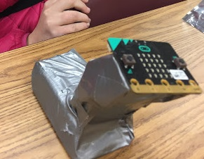

# 01.3 Innovation Project: Micro:robot

This project is an opportunity for students to create a micro:robot with the help of the partner that interviewed them in the Unplugged activity. They should review their notes and try to summarize what their partner finds appealing in a robot. Then, they should use whatever materials are available to create a prototype of a robot they would like from the help of their partner.

We often ask students to sketch a few designs on paper first, then consult with their partner to see which aspects of those designs they find most appealing. The purpose of prototyping is to gather more feedback to help you in your final design (“I like this part from Idea A, and I like this part from Idea B…”)

Build a micro:robot that:

- Matches your ideas from your partner’s feedback
- Supports the microbit and its battery pack
- Allows you to easily access the microbit to turn it on and off

Your design should use whatever materials are available to support the microbit so that its face is showing. You can be creative and decide how to mount the board, and how to decorate your robot.

Think about the following questions when you construct it:
- What kind of robot will it be? Will it have animal characteristics? Will it have human characteristics?
- Will it have any moving parts?
- If it moves, how can you hold the microbit securely?

Some photos of sample micro:robots below!

## Ideas for Modifications
- Find a way to make part of the robot move.
- Give your robot a natural habitat.
- Create a way to carry your robot.
- Create an robot that reacts when you touch it or move it (find a way to detect when the microbit is moved or when its position changes in a certain way.)

## Reflection
Have students write a reflection of about 150–300 words, addressing the following points:
- Summarize the feedback you got from your partner on your idea. How would you revise your design, if you were to go back and create another version?
- What was it like to have someone designing a pet or robot for you? Was it a pet or robot you would have enjoyed? Why or why not? What advice did you give them that might help them redesign?
- What was it like to interview your partner? What was it like to be listened to?
- What was something that was surprising to you about the process of designing the micro:pet?
- Describe a difficult point in the process of designing the micro:pet, and explain how you resolved it.
- Reflection handout. https://goo.gl/C4oLWH or “Coding & Innovation using Microbits” booklet http://bit.ly/codingmicrobitsbooklet  

## Rubric
For creative projects such as these, we normally don’t use a qualitative rubric to grade the creativity or the match with their partner’s suggestions. We just check to make sure that the micro:robot meets the required specifications:
- Program properly downloaded to microbit
- microbit supported so the face is showing
- microbit can be turned on and off without taking robot apart
- Turned in notes on interview process
- Written reflection (prompt is above)

## Micro:Robot Examples
**Robot Dog**

** Robot Alligator **

### Credits 
This project heavily utilizes the open source work done by Douglas & Mary Kiang who wrote the course “Intro to CS using Microbits”. It is published by Microsoft MakeCode team and Microbit.org. [https://makecode.microbit.org/courses/csintro](https://makecode.microbit.org/courses/csintro)
